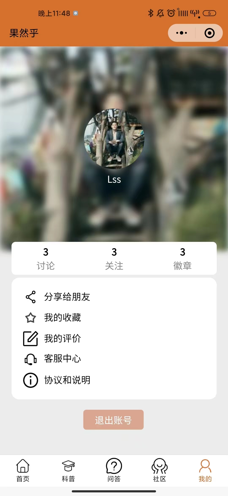

# 果然乎小程序
以AI识别水果成熟度为背景开发的小程序；具有拍照识别水果成熟度，社区模块，科普文章模块以及自动回复模块；

## 简介
在乡村振兴的大背景下，我们开创性地**以菜谱为切入点**，以**小切口推动大发展**。“乡村特色菜谱”是我们输出烹饪文化、菜品文化，同时推广乡村农产品、促进农民增收并构建乡村形象及乡村品牌的主要渠道。

### 功能点
**1.  社区模块：**

-   社区浏览
-   社区评论
-   社区发帖

**2.  科普文章模块：**

-   浏览科普文章
-   科普文章点赞

**3.  机器人回复模块：**

-   使用机器人进行问答

**4.  登录模块：**
-   登录系统：用户可以通过微信进行系统登录。

### 项目亮点
( 1 ) 使用Redis进行缓存 ，将短时间内不会频繁改变的结果进行缓存一段时间 ，减少服务器压力 ，使用布隆过滤器解决缓存雪崩的问题，并对缓存穿透以及缓存击穿进行了处理 ；

( 2 ) 使用Redis的Set集合存储点赞，实现社区点赞功能，减轻服务器压力；同时也使用Redis的ZSet集合存储热搜文字，实现科普文章热搜功能；同时使用Redis自带的GEO功能实现附近的人功能，提高用户体验；

( 3 ) 使用Redis的事务机制来保证数据的一致性，确保多个用户同时点赞时不会造成数据错误；并且将点赞数据定时写入数据库持久化存储；

( 4 ) 使用Kafka对评论功能进行异步削峰，减轻系统的负载压力，同时也对评论进行了预加载，提高响应速度；

( 5 ) 使用预先设定好的敏感词初始化前缀树，实现对用户发布的敏感词进行过滤，以避免用户发布可能的敏感词；

( 6 ) 基于ElasticSearch的机器人对话功能，通过ElasticSearch分词查询提高回复内容的准确性；

( 7 ) 使用基于用户的协同过滤算法，进行科普文章的个性化推荐；

( 8 ) 使用基于令牌桶算法的RateLimiter类实现流量限制，并实现注解AOP，来进行接口限流；

( 9 ) 数据库使用Mycat实现分库分表，以及两主两从读写分离；并且使用Canal结合Rabbitmq实现数据库和缓存的同步，保证数据的一致性。

### 项目结构
```
└─demo
    ├─aop
    │  └─Limit
    │      └─annotation
    ├─config
    ├─controller
    ├─dao
    ├─Filter
    ├─pojo
    ├─service
    ├─src
    │  ├─main
    │  │  ├─java
    │  │  │  └─com
    │  │  │      └─example
    │  │  │          └─demo
    │  │  │              ├─aop
    │  │  │              │  └─Limit
    │  │  │              │      └─annotation
    │  │  │              ├─controller
    │  │  │              ├─dao
    │  │  │              ├─Filter
    │  │  │              ├─pojo
    │  │  │              ├─service
    │  │  │              └─utils
    │  │  └─resources
```

## 开发环境

**开发环境**

小程序运行软件：微信开发者工具

小程序框架：vant框架

服务器端运行软件：Intellij IDEA

服务端框架：SpringBoot+MyBaits+Redis

**部署情况**

服务器版本：Linux64位Ubuntu 20.04 64位

云服务所在：阿里云服务器

带宽：1Mbps按固定带宽

CPU：1核

内存：2GB

JDK版本：1.8

## 页面展示



## 其他项目
抖音青训营后端项目——简易抖音【GO、Gorm】：https://github.com/oraeorae/GoDouYin

Code代码极速开发平台【SpringCloud】：https://github.com/oraeorae/mycloud

乡村特色菜谱【SpringBoot】：https://github.com/oraeorae/Recipe

失物招领小程序后端【SpringMVC】：https://github.com/oraeorae/LostThing

寻觅美食APP【SpringBoot】：https://github.com/oraeorae/food